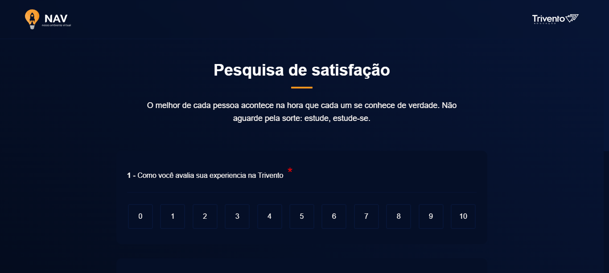

<h1 align="center"> Satisfaction Survey </h1>

 Projeto feito como teste para uma vaga de front-end para empresa Trivento.

  <a href="#-tecnologias">Tecnologias</a>&nbsp;&nbsp;&nbsp;|&nbsp;&nbsp;&nbsp;
  <a href="#-projeto">Projeto</a>&nbsp;&nbsp;&nbsp;|&nbsp;&nbsp;&nbsp;
  <a href="#-layout">Layout</a>&nbsp;&nbsp;&nbsp;|&nbsp;&nbsp;&nbsp;
  <a href="#memo-licença">Licença</a>

  

 

  

## 🚀 Tecnologias

---

Esse projeto foi desenvolvido com as seguintes tecnologias:

- Vite
- React JS
- TypeScript
- Styled components
- Git
- Github

## 💻 Projeto

---

Página para pesquisa de satisfação sobre servidos/faculdades da Trivento.  
Acesso ao código do projeto [Repositório Github](https://github.com/MatheusRamalho/satisfaction-survey)

## 🔖 Layout

---

Você pode visualizar o layout do projeto através [DESSE LINK](https://www.figma.com/file/tmR2n6qjfq08e7lnCdoCXK/Satisfaction-Survey---Trivento?node-id=0%3A1&t=sgJTqzES575w2VIv-1).  
É necessário ter conta no [Figma](https://figma.com) para acessá-lo.

## 🔖 Licença

Esse projeto está sob a licença MIT.

---

Projeto proposto pela Trivento como teste  
